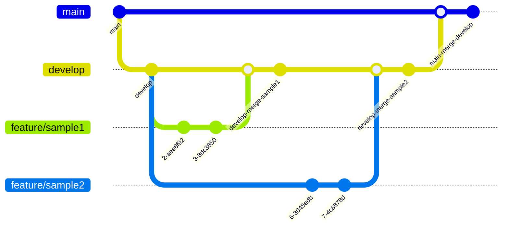

# 自慢プロジェクトバックエンド

社内で使用している『[自慢プロジェクト](https://blue-ground-0332b1a00.3.azurestaticapps.net/)』のバックエンドリポジトリです。


## ディレクトリ構造

```txt
.
├── Dockerfile              :
├── docker-compose.yml      :
├── backend/                : Nest.jsプログラム
└── README.md               : 
```

## 起動方法

firebaseの接続情報を環境変数として、./backend/.env.localを作成して接続情報を設定。

```txt
FIREBASE_PROJECT_ID="xxxxxxxxxxxxxxxxxxxxx"
FIREBASE_PRIVATE_KEY="xxxxxxxxxxxxxxxxxxxx"
FIREBASE_CLIENT_EMAIL="xxxxxxxxxxxxxxxxxxx"
```

接続情報に関しては、`@Ryunosuke-Tanaka-sti`に問い合わせをお願いします。

環境はVS CodeのDevContainerを使用して作成しています。VS Codeから環境を動作させてください。

- [http://localhost:3000](http://localhost:3000)にAPIがホストされる。
- [http://localhost:3000/api](http://localhost:3000/api)にopenAPI仕様書が押すとされます

## ブランチ運用

Git Flowを採用



- issueに対応する場合は`feature/issue〇〇`で対応
- Pull Requestでdevelopにマージすることを基本運用とする
- レビューには`@Ryunosuke-Tanaka-sti`を追加

## リソース

- [Frontend:pride-project(Azure Static Web Apps)](https://portal.azure.com/#@ntakeisios.onmicrosoft.com/resource/subscriptions/f682b8b9-db81-412d-97da-c8a2c93d586a/resourceGroups/ryu_test/providers/Microsoft.Web/staticSites/pride-project/staticsite)
- [BFF:pride-content(Azure Web Apps)](https://portal.azure.com/#@ntakeisios.onmicrosoft.com/resource/subscriptions/f682b8b9-db81-412d-97da-c8a2c93d586a/resourceGroups/ryu_test/providers/Microsoft.Web/sites/pride-content/appServices)

## 画面設計書

2024-04-24現在整備中です。
Figmaにアクセスしたい場合は、`@Ryunosuke-Tanaka-sti`に問い合わせをよろしくお願いします。

[Figma](https://www.figma.com/file/6Ic1LeHOfLHfkkM5WNMhTb/%E8%A9%A6%E9%A8%93%E5%A0%B4?type=design&node-id=0%3A1&mode=design&t=h5VULBOXgvdlip86-1)
