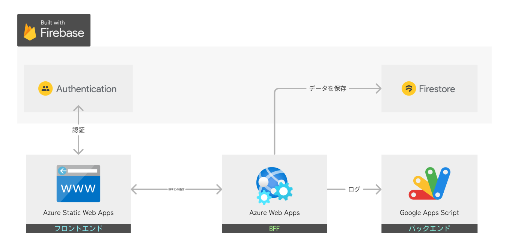
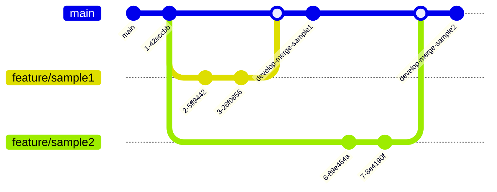
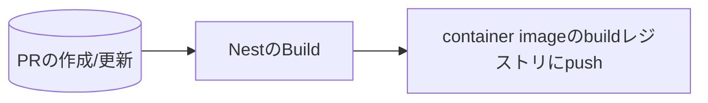
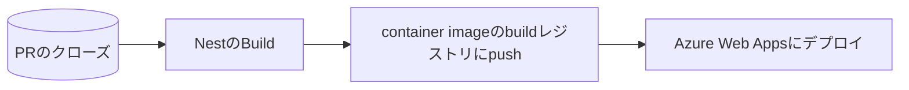

# 自慢プロジェクトバックエンド

社内で使用している『[自慢プロジェクト](https://blue-ground-0332b1a00.3.azurestaticapps.net/)』のバックエンドリポジトリです。

## システム構成図



### リポジトリ-ソースコード

- [フロントエンド：ps-pj-pride-project](https://github.com/SIOS-Technology-Inc/ps-pj-pride-project.git)
- [BFF：ps-pj-pride-project-backend](https://github.com/SIOS-Technology-Inc/ps-pj-pride-project-backend.git)

### デプロイ先

- [フロントエンド:pride-project(Azure Static Web Apps)](https://portal.azure.com/#@ntakeisios.onmicrosoft.com/resource/subscriptions/f682b8b9-db81-412d-97da-c8a2c93d586a/resourceGroups/ryu_test/providers/Microsoft.Web/staticSites/pride-project/staticsite)
- [BFF:pride-content(Azure Web Apps)](https://portal.azure.com/#@ntakeisios.onmicrosoft.com/resource/subscriptions/f682b8b9-db81-412d-97da-c8a2c93d586a/resourceGroups/ryu_test/providers/Microsoft.Web/sites/pride-content/appServices)

### 認証・DB

- [本番環境：Firebase](https://console.firebase.google.com/project/react-test-7d3b6/overview?hl=ja)
- [検証環境：Firebase](https://console.firebase.google.com/project/pride-project-local/overview?hl=ja)

## 実行方法

firebaseの接続情報を環境変数として、./backend/.env.localを作成して接続情報を設定。

```txt
FIREBASE_PROJECT_ID="xxxxxxxxxxxxxxxxxxxxx"
FIREBASE_PRIVATE_KEY="xxxxxxxxxxxxxxxxxxxx"
FIREBASE_CLIENT_EMAIL="xxxxxxxxxxxxxxxxxxx"
```

接続情報に関しては、`@Ryunosuke-Tanaka-sti`に問い合わせをお願いします。

環境はVS CodeのDevContainerを使用して作成しています。VS Codeから環境を動作させてください。

- [http://localhost:3000](http://localhost:3000)にAPIがホストされる。
- [http://localhost:3000/api](http://localhost:3000/api)にopenAPI仕様書が押すとされます

## ディレクトリ構造

```txt
.
├── Dockerfile
├── README.md
├── backend
│   ├── README.md
│   ├── nest-cli.json
│   ├── node_modules
│   ├── package-lock.json
│   ├── package.json
│   ├── src
│   │   ├── app.controller.spec.ts
│   │   ├── app.controller.ts
│   │   ├── app.module.ts
│   │   ├── app.service.ts
│   │   ├── common
│   │   │   ├── exception                               # エラーオブジェクトのラッパー集
│   │   │   └── guard                                   # Guard
│   │   │       ├── dummy-guard                         # 検証用ダミーガード
│   │   │       └── google-id-token-verify-grant-id     # Googleの認証検証
│   │   ├── config                                      # 環境変数とDBとの接続処理ラッパー
│   │   │   ├── enviroments.module.ts
│   │   │   └── enviroments.service.ts
│   │   ├── infrastructure                              # データベースとの入出力処理
│   │   ├── main.ts
│   │   ├── pride                                       # /api/pridesの処理
│   │   ├── pride-user                                  # /api/users/pridesの処理
│   │   └── types                                       # 型定義
│   ├── test                                            # テストコード
│   ├── tsconfig.build.json
│   ├── tsconfig.json
│   └── yarn.lock
└── docker-compose.yml
```

## 使用技術

- ビルドツール
  - NestJS CLI v10
- Core
  - NestJS v10
  - TypeScript v5.1.3
- 開発支援
  - prettier
  - eslint

## Gitの運用ルール

GitHub Flowを採用



### 基本ルール

- issueに対応する場合は`feature/issue〇〇`で対応
- Pull Requestでmainにマージすることを基本運用とする
- レビューには`@Ryunosuke-Tanaka-sti`を追加

### CI/CDの実行タイミング

#### PR時



#### PRクローズ時



## ドキュメント

### Slackチャンネル

`#ps-pj-自慢プロジェクト`までお問い合わせください。

### StoryBook

[https://sios-technology-inc.github.io/ps-pj-pride-project/](https://sios-technology-inc.github.io/ps-pj-pride-project/)

### 画面設計書

2024-04-24現在整備中です。
Figmaにアクセスしたい場合は、`@Ryunosuke-Tanaka-sti`に問い合わせをよろしくお願いします。

[Figma](https://www.figma.com/file/6Ic1LeHOfLHfkkM5WNMhTb/%E8%A9%A6%E9%A8%93%E5%A0%B4?type=design&node-id=0%3A1&mode=design&t=h5VULBOXgvdlip86-1)
